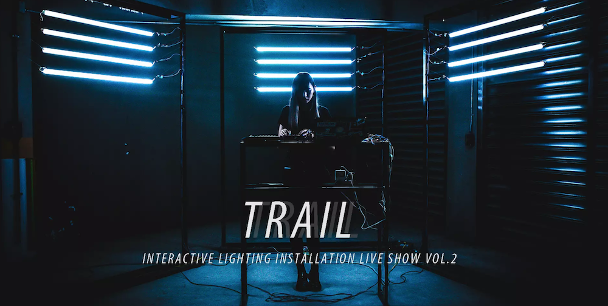

# Trail &middot; 

> :art: Interactive Lighting Installation Controlling System

It's prototyped in Processing.

## 0. Table of Contents  
- [Introduction](#1-introduction)
- [Links](#2-links)

## 1. Introduction

光留下的軌跡，證明了時間的存在。若固定了一段時間，而我們靜止不動，世界的變動化成一道道暈開的線條，透過光成像成一幅畫；而當我們快速地在這個空間穿梭，意識的迷濛反而靜止了世界、停止了時間，而在移動的我們，則成了光繪的藝術家。

## 2. Links

- [showcase](https://vimeo.com/222569600)

## 3. Credit

- Installation Design : Asking Gee
- Technical Instructor : Vibert Thio
- Hardware assistant : En-Wei Huang
